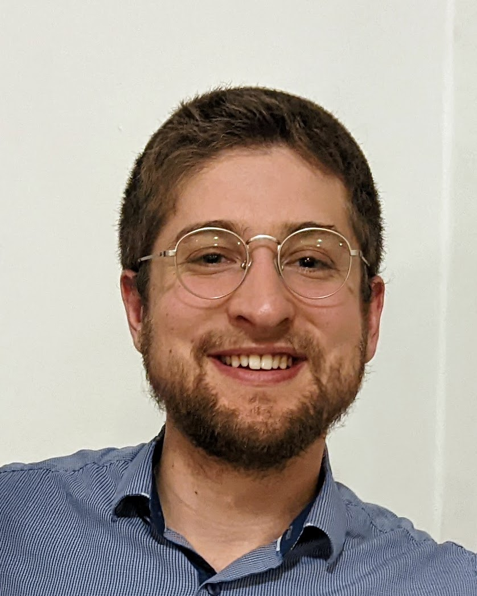

```{r setup, include=FALSE}
knitr::opts_chunk$set(echo = FALSE, warning = FALSE, message = FALSE)
```

Aside
================================================================================

<center>

</center>

Contact Info {#contact}
--------------------------------------------------------------------------------

<i class="fa fa-envelope"></i> louist@post.bgu.ac.il  
<i class="fa fa-globe"></i> [Home Page](https://rimonim.github.io) | <i class="fa fa-rss"></i> [Blog](https://rimonim.github.io/blog)  
<i class="fa fa-github"></i> [GitHub](https://github.com/rimonim) | <i class="fa fa-linkedin"></i> [LinkedIn](https://www.linkedin.com/in/louisteitelbaum/)   

Languages {#languages}
--------------------------------------------------------------------------------

English - native  
Hebrew - fluent  

Technical Skills
--------------------------------------------------------------------------------

**Programming:** R, Python, SQL, Git(Hub), SPSS.

**Documentation:** (R)Markdown/Quarto, JupyterLab, Google Docs/Sheets.  

**Design:** ggplot2, Gimp, Photoshop, Inkscape

**Deployment:** Shiny, Streamlit

Disclaimer {#disclaimer}
--------------------------------------------------------------------------------

Last updated on `r Sys.Date()`.

Main
================================================================================

Louis Teitelbaum {#title}
--------------------------------------------------------------------------------

Professional Experience {data-icon=laptop}
--------------------------------------------------------------------------------

### Neurocognitive Psychology Researcher

N/A

N/A

Since 2020

***Working Memory and Predictive Processing***: 
- Thesis work under supervision of Prof. Yoav Kessler, Ben Gurion University

***Language and Communication***: 
- Thesis work under supervision of Prof. Bruno Galantucci, Yeshiva University Psychology Department
- Developed novel Natural Language Processing (NLP) based metrics for diadic conversations using Python and R.
- Wrote peer review
- Designed research agenda and experimental paradigm for the continuation of research post-COVID-19
- Read over 100 scholarly articles in the field of Language and Communication

***Power Dynamics in Long-Term Romantic Relationships***:
- Research Assistant for Dr. Jenny Isaacs, Yeshiva University Psychology Department
- Researched and designed survey for data collection.
- Analyzed data in SPSS and R; finalized analysis for publication.
- Logged over 200 hours as a primary contributor to project.

### R Developer

N/A

N/A

Since 2021

- Developer of [*wormsplot*](https://github.com/rimonim/wormsplot) for 
visualizing the movements of historical figures; Read the [blog post](https://rimonim.github.io/blog/medieval_philosophers).  

Education {data-icon=graduation-cap data-concise=true #education}
--------------------------------------------------------------------------------

### M.A. in Experimental Cognitive Psychology

Ben-Gurion University

Be'er Sheva, Israel

2022 - Present

**Supervisor:** Prof. Yoav Kessler

### B.A. in Psychology with Minor in Biology

Yeshiva University Honors

New York, NY

2018 - 2021

Graduated *Magna Cum Laude*

**Activities and societies:** Neuroscience Club President

Awards and Scholarships {data-icon=star-o #awards}
--------------------------------------------------------------------------------

### Chaplain Joseph Hoenig Memorial Award for Excellence in the Study of Psychology

Yeshiva University Psychology Department

New York, NY

Sep 2021

### American Psychology-Law Society Grant for Undergraduate Research, $1,000

American Psychological Association Division 41: American Psychology-Law Society

N/A

Jan 2021

For research in marital power dynamics in divorce mediation.

### Three funding awards from the Yeshiva University Honors Program

Yeshiva University Honors Program

New York, NY

2021

### Professor Michael Bernstein Award for Excellence in Biblical Studies

Yeshiva University

N/A

Sep 2021

Scientific Publications and Presentations {data-icon=file #pubs}
--------------------------------------------------------------------------------

### Theses

N/A

N/A

N/A

- **Teitelbaum, L.** (2021). [*When faithful informational exchange is just not worth it: Reformulation ability as a predictor of other-initiated repair* [Honors thesis, Yeshiva University]. Yeshiva Academic Institutional Repository.](https://repository.yu.edu/handle/20.500.12202/7148)

### Poster Presentations

N/A

N/A

N/A

- **Teitelbaum, L.** & Galantucci, B. (2021). When faithful informational Exchanges are just too much work: Repair avoidance and reformulation cost. *Poster presented at the 2021 Association for Psychological Science (APS) Virtual Convention*.
- **Teitelbaum, L.**, Isaacs, J., & Pittinsky, N. (2021). Is power all bad? Marital power imbalances and effective role division. *Poster presented at the 2021 Association for Psychological Science (APS) Virtual Convention*.


